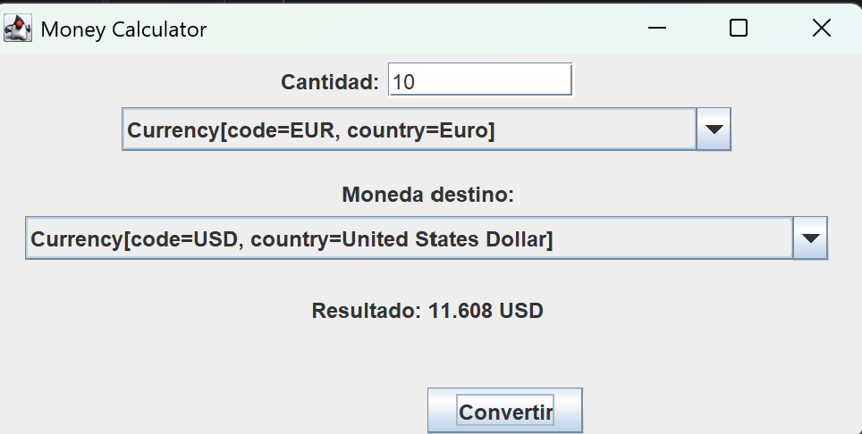

# Money Calculator

## Descripción
Esta práctica consiste en el desarrollo de una **calculadora de cambio de divisas** en Java, aplicando el patrón **Modelo–Vista–Controlador (MVC)** junto con una **arquitectura desacoplada** basada en interfaces y el patrón **Command**.

La aplicación permite convertir una cantidad de dinero de una moneda origen a una moneda destino utilizando un **servicio web externo de tipos de cambio**.

La principal ampliación de esta versión es la incorporación de una **interfaz gráfica de usuario (GUI)** que permite interactuar con la aplicación de forma visual e intuitiva.

---

## Arquitectura MVC

La aplicación está diseñada siguiendo el patrón **MVC**, separando claramente responsabilidades y favoreciendo la extensibilidad y el mantenimiento del código.

### Modelo (Model)
Contiene las clases que representan el dominio del problema y no dependen de la interfaz gráfica ni del control:

- `Money`
- `Currency`
- `ExchangeRate`

Estas clases encapsulan los datos y reglas básicas del negocio.

---

### Controlador (Controller)
Gestiona la lógica de la aplicación y coordina la comunicación entre el modelo y la vista.

- `ExchangeMoneyCommand`
- `Command`

El controlador:
- Obtiene los datos desde la vista
- Solicita los tipos de cambio
- Realiza la conversión
- Devuelve el resultado a la vista

La lógica de negocio **no depende de Swing ni de la consola**, cumpliendo el principio de inversión de dependencias.

---

### Vista (View)
Se encarga exclusivamente de la interacción con el usuario.  
La vista se comunica con el controlador únicamente mediante **interfaces**, lo que permite cambiar el tipo de interfaz sin modificar el resto de la aplicación.

Interfaces de la vista:
- `MoneyDialog`
- `CurrencyDialog`
- `MoneyDisplay`

---

## Interfaz Gráfica (GUI)

La interfaz gráfica ha sido desarrollada utilizando **Swing**, implementando las interfaces de la capa de vista del patrón MVC.

### Componentes principales
- Campo de texto para introducir la **cantidad**
- Desplegable (`JComboBox`) para seleccionar la **moneda de origen**
- Desplegable (`JComboBox`) para seleccionar la **moneda de destino**
- Botón **Convertir**
- Etiqueta para mostrar el **resultado del cambio**

Los componentes se disponen de forma vertical siguiendo un orden lógico para mejorar la usabilidad.

---

## Implementación de la interfaz gráfica

La GUI se compone de las siguientes clases:

- `SwingMoneyDialog` → implementación de `MoneyDialog`
- `SwingCurrencyDialog` → implementación de `CurrencyDialog`
- `SwingMoneyDisplay` → implementación de `MoneyDisplay`
- `MoneyCalculatorFrame` → ventana principal de la aplicación

El botón **Convertir** ejecuta un `ExchangeMoneyCommand`, manteniendo la separación entre vista y controlador propia del patrón MVC.

---

## Validaciones y usabilidad

La interfaz gráfica incluye validaciones para evitar errores de ejecución y mejorar la experiencia de usuario:

- No se permite realizar la conversión si la cantidad está vacía
- Se muestran mensajes de error si el valor introducido no es numérico
- La aplicación no se cierra ante errores de entrada
- Los desplegables de monedas están ajustados para mostrar correctamente sus valores

---

